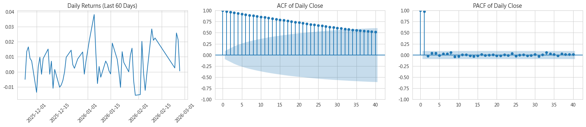
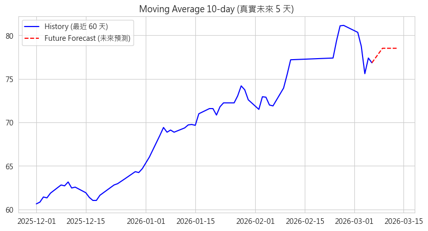
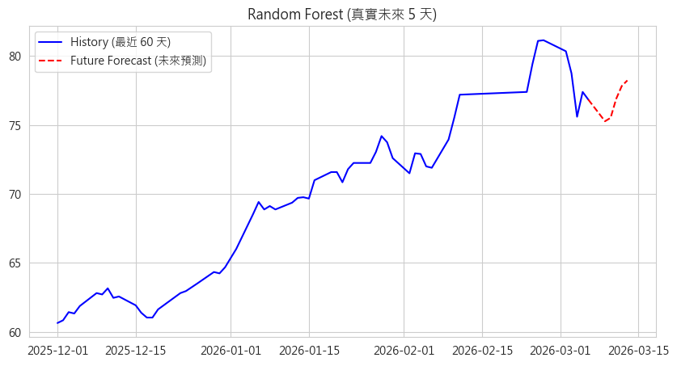

# StockSecretary
StockSecretary is a Python-based stock forecasting prototype that focuses on Taiwan stock data collection, technical indicator generation, and short-term price forecasting with multiple time-series methods.

## Project Overview

This repository was built as a personal portfolio project inspired by earlier coursework in stock analysis and later self-directed exploration in Python-based forecasting workflows.

The current version focuses on:
- collecting stock price data programmatically
- generating technical indicators
- comparing several forecasting approaches
- visualizing forecasting results with charts

This repository is currently a forecasting and analysis prototype rather than a complete chatbot or production-ready system.

## Why I Built This

I originally became interested in whether stock analysis workflows could be made more interactive and easier to understand through Python automation.

Instead of only analyzing historical data manually, I wanted to explore a workflow that could:
1. fetch stock data automatically,
2. prepare the data for analysis,
3. test multiple forecasting methods,
4. generate result charts for comparison.

This repository represents the current stage of that idea.

## Current Scope

At this stage, the project mainly includes:
- a Python script for fetching stock data and generating indicators
- a notebook for running the main daily price forecasting pipeline
- archived coursework and experimental notebooks for comparison
- sample output figures for forecasting results

Some parts of the workflow were developed with AI-assisted coding / vibe coding support, then reviewed and reorganized into this portfolio version.

## Repository Structure

```text
.
├─ daily_price_forecast_pipeline.ipynb
├─ fetch_stock_with_indicators.py
├─ pictures/
│  ├─ auto_arima.png
│  ├─ daily_return_acf_pacf.png
│  ├─ moving_average.png
│  ├─ naive_forecast.png
│  ├─ random_forest.png
│  └─ simple_exp_smoothing.png
└─ archive/
   ├─ coursework/
   └─ experiments/
```

### Main Files
- `daily_price_forecast_pipeline.ipynb`  
  Main notebook for running the forecasting workflow and comparing methods.

- `fetch_stock_with_indicators.py`  
  Script for fetching stock data and generating technical indicators.

- `pictures/`  
  Output figures used to present forecasting results.

- `archive/coursework/`  
  Older course-related notebooks and source files kept for learning record.

- `archive/experiments/`  
  Experimental notebooks for alternative forecasting attempts.

## Forecast Examples

### Auto ARIMA


### Daily Return / ACF / PACF


### Moving Average


### Naive Forecast


### Random Forest


### Simple Exponential Smoothing


## Limitations

This project is still a prototype and has several limitations:
- it is not a production-ready stock analysis platform
- generated data files are not included in the repository
- the current workflow is focused on experimentation and visualization
- model evaluation and backtesting are still limited
- this project does not provide financial advice

## Future Work

Possible future improvements include:
- improving data pipeline robustness
- adding clearer model evaluation metrics
- supporting more Taiwan stocks
- reorganizing the code into a cleaner modular structure
- integrating the forecasting workflow into a more interactive interface in the future
